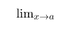
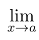
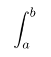
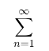
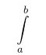
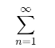
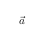

# Calculus notation

* Text is usually displayed in italics in math mode. To display text upright(non-italic), use the command `\mathrm{<variable name>}`.
* `\infty` &rarr; command for infinity in math mode in $\LaTeX$.

* More $\LaTeX$ commands are in [calculus.tex](https://github.com/0x50-0x42/latex/blob/LaTeX/notes/teXfiles/calculus.tex). To view the outputs, see [calculus.pdf](https://github.com/0x50-0x42/latex/blob/LaTeX/notes/teXfiles/calculus.pdf).

* To view the word `lim` in non-italic in math-mode, we use the command `\lim`.
```tex
....
....
\begin{document}
	\lim_{x \to a}
\end{document}
```
With this command, we will only see this output:



* To view the arrow in limit, we use the `\to` command.

* If we want 'x &rarr; a' to appear below `lim`, then we have to use the `\limits` command as:
```tex
....
....
\begin{document}
	\lim\limits_{x \to a}
\end{document}
```



* If our fractions, integral symbol, summation symbols, etc. are appearing to be smaller than we wanted, then it means $\LaTeX$ is actually trying to fit in those symbols in math mode. If we want them to appear normal then we can enclose the mathematical expression within `\displaystyle{}`.
* `\delta` &rarr; small delta.
* `\Delta` &rarr; capital delta(the triangle).

* `\int` &rarr; integration.
* `\sum` &rarr; summation.
* We can set limits to these mathematical symbols, in two ways:
* First way:
```tex
....
....
$\displaystyle{\int_{a}^{b}}$\\

$\displaystyle{\sum_{n=1}^{\infty}}$
```

while will produce the following outputs:





* Second way:
```tex
....
....
$\displaystyle{\int\limits_{a}^{b}}$\\

$\displaystyle{\sum\limits_{n=1}^{\infty}}$
```





* We might want to add the three dots(`...`) while writing a sequence of numbers, for that we use `\cdots` command. This produces a horizontal ellipsis where the dots are raised to the center of the line. For a single dot, we write `\cdot`.

* To write vectors, we use the `\vec` command in math mode.
```tex
$\vec{a}$
```
This produces the following output:



* To write angle brackets in math mode, we use the commands `\langle` and `\rangle`.

---
